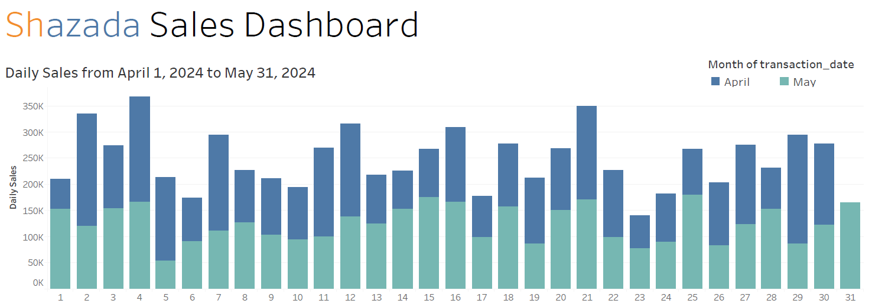

# E-Commerce Sales & Customer Behavior Analysis

## Project Overview
This project focuses on extracting actionable business intelligence from an e-commerce database. By utilizing advanced SQL techniques, the analysis provides insights into revenue trends, geographic performance, customer loyalty, and month-over-month growth. These queries are designed to support data-driven decision-making for retail operations and marketing strategies. The full dashboard can be viewed as dashboard.pdf.

## Technical Highlights
* **Complex Data Aggregation:** Multi-table joins across sales, product, and customer dimensions.
* **Advanced SQL Logic:** Extensive use of **Common Table Expressions (CTEs)** to modularize complex logic.
* **Analytical Functions:** Implementation of **Window Functions** (`ROW_NUMBER() OVER`) for intra-category ranking.
* **KPI Development:** Calculation of business metrics such as Month-over-Month (MoM) growth and high-value customer profiling.

---

## Business Use Cases Analyzed

### 1. Revenue & Trend Monitoring
* **Daily Sales Tracking:** Monitors daily revenue flow to identify peak transaction periods.
* **Monthly Performance Summaries:** Aggregates data into fiscal months to assess seasonal trends.

### 2. Geographic & Product Insights
* **Regional Market Distribution:** Evaluates sales performance by city to inform localized marketing.
* **Product Revenue Ranking:** Identifies "Hero Products" that contribute most significantly to the bottom line.
* **Market Basket by City:** Determines the top 10 performing products within specific regions to optimize inventory distribution.

### 3. Customer Intelligence
* **Engagement & Loyalty:** Profiles customers based on total purchase volume to identify candidates for loyalty programs.
* **VIP Profiling:** Identifies the highest-spending customers and isolates their most-purchased products for personalized retention offers.

### 4. Growth Metrics
* **Inventory Turnover:** Measures the change in unit sales volume between consecutive months to track business scaling.

---

## Data Privacy & Availability
**Note on Dataset:** To maintain confidentiality and comply with data privacy standards, the raw dataset used for this analysis is **not included** in this repository. 
* The queries provided are executed against a **sanitized sample database**.
* The results and visualizations shown are based on **mock data** designed to demonstrate the logic and functionality of the SQL scripts.
* No personally identifiable information (PII) or proprietary business secrets are contained within this project.

---

## Database Schema
The analysis is performed on a relational database consisting of three primary tables:
* `customer_purchase`: Transactional data including dates, quantities, and product IDs.
* `product`: Product catalog containing unit prices and naming conventions.
* `customer`: Demographic data including names and geographic locations (city).
